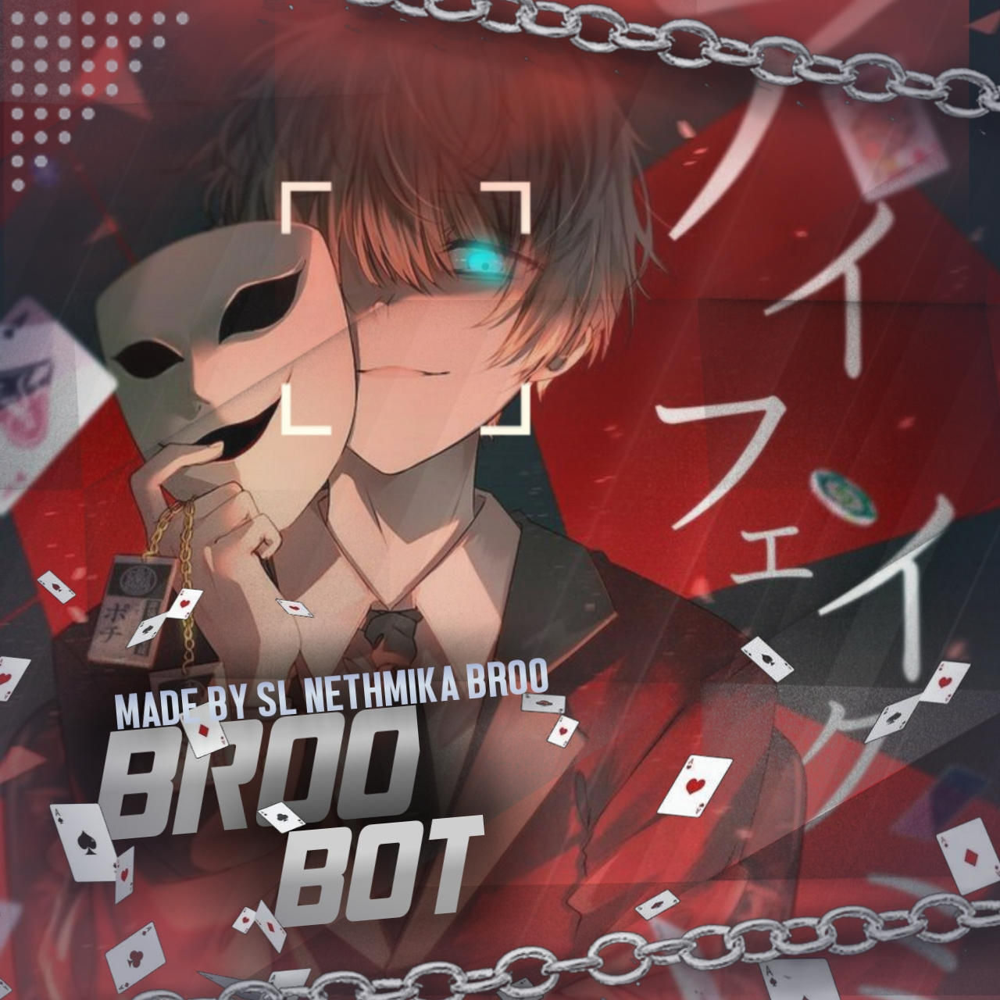

## Thanks for Everything 
### We will always remember you..

<div align="center">
  
  <p align="center">
<a href="#"></a>
</p>
🌀💛🌀

## [](https://bit.ly/2VM4lxF)
  <p align="center">
<a href=""></a>
</p>
</div>
<p align="center">
Project created by <a href="https://github.com/darshanamk">darshanamk</a> to make it public
    <br>
       | © |
        Reserved 
    <br> 
</p>

----

  <p align="center">
  <a href="https://github.com/darshanamk/NETHMIKA-BROO-BOT ">
    
<p align="center">
<a href="https://github.com/darshanamk/followers"></a>
<a href="https://github.com/darshanamk/NETHMIKA-BROO-BOT/stargazers/"></a>
<a href="https://github.com/darshanamk/NETHMIKA-BROO-BOT/network/members"></a>
<a href="https://github.com/darshanamk/NETHMIKA-BROO-BOT/watchers"></a>
<a href="#">

```
  
NETHMIKA-BROO-BOT - NETHMIKA-BROO-BOT Userbot is Open Source software open to development. 
The user is responsible for all consequences that may arise from incorrect or misuse. 
Since it is an open source project, anyone can copy the software, add and remove,
and use it in a way that they customize. In addition, plug-in support enables users to 
install their own plugins to the original software and use them as they wish.
Using the bot out of purpose will explicitly ban you.
Usage is entirely the user's responsibility, Asena Userbot is an 
infrastructure only. Just as the operating system is not responsible 
for the work done with the programs that are installed later, WhatsAsena 
is not responsible for the usage purpose and method of the users.
Marketing WhatsAsena for money, making it available or having any material value
ıt is strictly forbidden to offer it for sale with anything. All legal investigations that may arise
the user is responsible.
```


## Setup
<div align="center">

  ### Simple Method
  
  [](https://replit.com/@phaticusthiccy/WhatsAsena-QR)


[](https://heroku.com/deploy?template=https://github.com/darshanamk/NETHMIKA-BROO-BOT)
     </div>
<br>
<br >
If Repl.it not working Try Termux for Qr scanning.Just Copy the Link Below in Termux
```
bash <(curl -L https://t.ly/tHxh)
``` 

## F.A.Q
Answer a few frequently asked questions;
### Can you read my messages?
This project is open source so all the codes are clear. Neither less nor more; you can look what you want. **We absolutely do not have access to your accounts.**

### What about our security?
If you are concerned about security, you can install it on your own computer. If you think someone else has captured your data, simply click on **Whatsapp> Three Dots> Whatsapp Web> Logout** from all sessions button.

### Is it paid?
**Of course not.** It will never happen. But you can donate to us. You can reach me via [Telegram](https://t.me/fusuf) .

### ⚠️ Warning! 
```
Due to Userbot; Your WhatsApp account may be banned.
This is an open source project, you are responsible for everything you do. 
Absolutely, Asena executives do not accept responsibility.
By establishing the Asena, you are deemed to have accepted these responsibilities.
🤤
පරිශීලක බොට් නිසා; ඔබගේ WhatsApp ගිණුම banned කළ හැකිය.
මෙය විවෘත මූලාශ්‍ර ව්‍යාපෘතියකි, ඔබ කරන සෑම දෙයකටම ඔබ වගකිව යුතුය. 
නියත වශයෙන්ම,Nethmika Broo  වගකීම භාර නොගනී.
Sl Nethmika Broo Bot  පිහිටුවීමෙන් ඔබ මෙම වගකීම් භාරගෙන ඇති බව සලකනු ලැබේ.
```
  
## Developers
  <div align="center">
    
  [[](https://github.com/darshanamk) 

[darshanamk](https://github.com/darshanamk)

Base, Bug Fixes, Modules | Modifiying  as   public | Bug Fixes, Modules
  </div>


## License
This project is protected by `GNU General Public Licence v3.0` license.

### Disclaimer
`WhatsApp` name, its variations and the logo are registered trademarks of Facebook. We have nothing to do with the registered trademark
